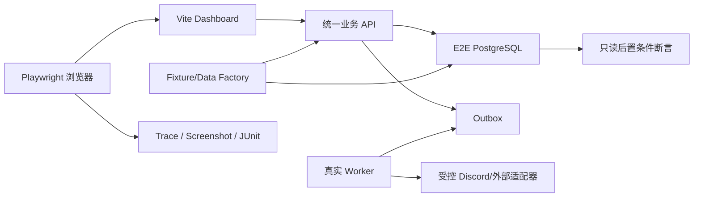

# Dashboard E2E 自动化测试开发计划

> 文档状态：开发计划
> 适用范围：当前 P0 Dashboard 已实现且能够全自动执行的功能
> 数据环境：专用纯测试 PostgreSQL，可按测试需要创建、修改和清理数据
> 不包含：人工 UAT、真实 Discord Guild 操作、真实 OAuth 授权、人工签署与生产环境验证

## 1. 目标

建立一套可在本地和 CI 中重复运行的 Dashboard 浏览器 E2E 测试，验证：

1. 浏览器通过真实 Dashboard 调用统一业务 API，不绕过服务端权限、金额和状态规则。
2. Dashboard、API、PostgreSQL 和 Worker 组成的完整链路产生正确业务状态、资金事实、审计和异步结果。
3. L1–L4、Guild 隔离、MFA/step-up、CSRF、会话撤销和幂等控制在浏览器链路中有效。
4. 订单、用户、陪玩、目录、套餐、钱包、礼物、收益、结算和系统运营的主要成功、拒绝、冲突及恢复路径可自动回归。
5. 每次失败保留可复核的浏览器 trace、截图、网络记录、request_id 和必要数据库快照。

本计划不把现有 Vitest 组件/契约测试计作浏览器 E2E。现有测试继续承担快速单元、API、数据库和合同回归，新的 E2E 层只覆盖跨进程关键行为。

## 2. 自动化边界

### 2.1 纳入范围

- React/Vite Dashboard 的真实页面导航、表单、Dialog、列表、详情、分页、下载和错误反馈。
- Fastify 统一业务 API、真实安全中间件、幂等、审计和 Actor Context 解析。
- 真实 PostgreSQL migration、约束、事务、并发和 append-only 保护。
- 真实 Worker 的 Outbox 消费、失败、重试和恢复。
- Discord Role 同步、OAuth 身份结果及 Discord 下游成功/失败通过受控测试适配器或可信事件 fixture 自动模拟。
- CSV 导出内容、响应 Header、编码和 Guild/币种隔离。
- Chromium 全量测试；Firefox 和 WebKit 运行核心 smoke 与高风险写操作子集。

### 2.2 不纳入范围

- 登录真实 Discord 账号、操作真实 Guild、真实频道或语音房。
- 人工视觉验收、产品/运营/客服签署。
- 生产数据、生产密钥、真实支付渠道或真实外部转账。
- Discord Bot 消息组件的真实客户端操作；跨客户端一致性只自动验证统一 API、审计和受控适配器输出。
- 尚未接入 Dashboard 路由的独立模型，例如当前未挂载的陪玩工作台、gift-review 和 automation-control 视图。

## 3. 推荐技术方案

### 3.1 测试栈

- 浏览器执行器：Playwright Test，使用与 Node.js 22 兼容的仓库锁定版本。
- 应用进程：真实 Vite Dashboard、Fastify API 和 Worker。
- 数据库：独立 PostgreSQL E2E database，启动时执行 canonical Prisma migration。
- 外部边界：测试专用 OAuth/Discord adapter，不修改业务规则，只返回可配置的成功、拒绝、超时和重复事件。
- 断言：页面可见状态 + API 响应 + 只读数据库查询三层断言。
- 证据：Playwright HTML/JUnit report、trace、失败截图、video、console、network 和 request_id 索引。

### 3.2 建议目录

以下路径在实施 Story 中创建，名称可在不改变职责的前提下微调：

```text
tests/e2e/dashboard/
├── auth/
├── support/
├── orders/
├── users-wallet/
├── players/
├── catalog/
├── gifts-earnings/
├── settlements/
├── operations-security/
└── smoke/
tests/e2e/fixtures/
├── actors.ts
├── guilds.ts
├── factories.ts
├── sessions.ts
├── database.ts
├── discord-adapter.ts
└── assertions.ts
playwright.config.ts
scripts/e2e/
├── prepare-database.*
├── start-stack.*
└── collect-evidence.*
```

### 3.3 运行拓扑



业务对象优先通过统一 API factory 创建；只有以下情况允许 fixture 直接写测试数据库：

- 创建 OAuth/session、员工身份、Role mapping 等浏览器无法自助创建的测试前置条件。
- 构造历史状态、并发版本或故障记录，且必须继续满足数据库约束。
- 注入 FAILED Job、Outbox 或外部回调前置数据。
- 读取不可通过公开 API 观察的审计、不可变记录和零写入后置条件。

Dashboard 本身仍不得直连数据库。

## 4. 测试数据库与数据工厂

### 4.1 数据安全门禁

E2E 启动脚本必须同时满足以下条件，否则立即退出：

- `NODE_ENV=test`。
- `DATABASE_URL` 与普通开发/生产连接不同。
- database 名称带明确的 `_e2e` 或随机 worker 后缀。
- 禁止 host、database、role 命中生产配置 allow/deny guard。
- migration 使用 E2E database owner；应用仍使用受限 app role。
- 清理命令只能作用于已验证的 E2E database，不接受空变量、通配符或宽目录。

当前数据库虽为纯测试库，仍保留上述门禁，防止未来环境变量变化导致误清理。

### 4.2 隔离策略

- CI 每个 job 创建独立 database，例如 `blackcat_e2e_<run_id>_<shard>`。
- 本地默认创建 `blackcat_e2e_local_<pid>`，运行结束后可保留失败库用于调查。
- 测试文件并行时，按 worker 分配独立 Guild 和业务对象前缀；涉及全局策略或唯一约束的 suite 串行执行。
- 每个测试用例记录 `testRunId`，所有 publicId、Discord ID、receiptNumber、idempotency key 和 reasonCode 可追溯到该用例。
- 默认在测试结束后删除本用例数据；失败时根据 `E2E_KEEP_FAILED_DB=1` 保留数据库和连接信息。

### 4.3 固定 Actor 矩阵

| Fixture | 内部级别 | 用途 |
|---|---:|---|
| `staffL1A` | L1 | 客服任务、本人 scope、越权拒绝 |
| `staffL2A` | L2 | 订单处置、钱包操作、陪玩审核 |
| `staffL3A` | L3 | 目录、套餐、业务配置 |
| `staffL4CreatorA` | L4 | 权限配置、高额结算创建者 |
| `staffL4ApproverA` | L4 | 异人复核和审批 |
| `staffL2B` | L2 | 跨 Guild 隔离攻击 |
| `staffDowngradedA` | L3→L1/撤销 | permissions_version 和旧会话失效 |
| `nonStaffA` | 无 | 登录后 Forbidden |

每个 Actor 具有服务端生成的 Dashboard session、CSRF token、permissions_version、Guild 归属和可配置 step-up 状态。不得通过浏览器请求自报 actor level。

### 4.4 业务 Fixture 矩阵

| 领域 | 必备数据状态 |
|---|---|
| Guild | Guild A、Guild B、各自 Role mappings 和策略 |
| 用户 | 正常、暂停、停用、有风险事件、有历史订单 |
| 钱包 | 零余额、余额不足、有订单/礼物双预留、版本冲突 |
| 陪玩 | 待审核、已批准、已拒绝、不同标签和分成覆盖 |
| 订单 | DRAFT、PENDING_DISPATCH、ACCEPTED、IN_SERVICE、COMPLETED、CANCELLED、DISPUTED、EXCEPTION |
| 多陪玩订单 | 1 人、9 人不同项目、已捕获锁定、stale version |
| 服务/礼物目录 | ACTIVE、RETIRED、ARCHIVED、有历史引用、待发布新版本 |
| 套餐 | DRAFT、ACTIVE、RETIRED、跨游戏非法席位、并发发布 |
| 收益/返佣 | 待确认、已确认、已支付、来源用户需脱敏 |
| 结算 | 空周期、普通批次、高额批次、部分付款失败、已导出待作废 |
| 运维 | FAILED/COMPLETED Job、可/不可人工重试类型、审计分页数据 |

### 4.5 Factory API

测试数据工厂至少提供：

```ts
createGuildFixture()
createStaffFixture({ guildId, level, permissionsVersion, stepUp })
createDashboardSession({ staffId, csrf })
createCustomerFixture({ guildId, status, walletBalanceMinor })
createPlayerFixture({ guildId, reviewStatus, tags, compensationRules })
createCatalogFixture({ guildId, status, versions })
createServicePackageFixture({ guildId, status, slots })
createOrderFixture({ guildId, status, participants, reservations })
createGiftFixture({ guildId, status, historicalReference })
createSettlementFixture({ guildId, status, highValue, paymentResults })
createFailedJobFixture({ guildId, type, attempts })
expireSession()
downgradeStaffRole()
injectAdapterFailure()
readAuditRecords()
readWalletFacts()
```

Factory 返回稳定业务 ID、期望版本、浏览器入口 URL 和自动清理句柄。金额全部使用整数 minor units。

## 5. 自动化测试套件

优先级定义：

- `P0-BLOCKER`：失败时禁止候选发布。
- `P0-HIGH`：必须在全量回归通过；可在 PR quick suite 之外运行。

### 5.1 Smoke 与应用外壳

| ID | 优先级 | 自动化场景 | 主要断言 |
|---|---|---|---|
| DE2E-SMK-001 | P0-BLOCKER | Dashboard/API/DB/Worker 就绪 | health、ready、页面加载、无 console error |
| DE2E-SMK-002 | P0-BLOCKER | 有效员工 session 打开概览 | capabilities、环境标识、导航可见 |
| DE2E-SMK-003 | P0-HIGH | 浏览器前进、后退和刷新 | route 与 active nav 一致 |
| DE2E-SMK-004 | P0-HIGH | 各页面 Loading/Empty/Error | 不白屏，错误展示 request_id |
| DE2E-SMK-005 | P0-HIGH | feature profile 切换 | 禁用功能不出现在导航且直接 URL 不泄露数据 |

### 5.2 鉴权、RBAC、会话和安全

| ID | 优先级 | 自动化场景 | 主要断言 |
|---|---|---|---|
| DE2E-AUTH-001 | P0-BLOCKER | 未登录访问 | 显示登录 Gate，不发业务数据请求 |
| DE2E-AUTH-002 | P0-BLOCKER | 非 staff session | Forbidden，无业务内容 |
| DE2E-AUTH-003 | P0-BLOCKER | L1–L4 累积权限导航 | 页面、按钮与 capabilities 一致 |
| DE2E-AUTH-004 | P0-BLOCKER | 伪造 role/level/actor Header | API 403，零业务写入，有拒绝审计 |
| DE2E-AUTH-005 | P0-BLOCKER | 缺失或错误 CSRF | 写操作拒绝，页面提示可诊断 |
| DE2E-AUTH-006 | P0-BLOCKER | Role 降级/移除 | permissions_version 增加，旧 session 401 |
| DE2E-AUTH-007 | P0-BLOCKER | 跨 Guild 列表、详情和写入 | 不可读取，不可写入，审计归属正确 |
| DE2E-AUTH-008 | P0-BLOCKER | 高风险操作无 step-up | 返回 428，完成测试 challenge 后重试成功 |
| DE2E-AUTH-009 | P0-HIGH | step-up 过期 | 高风险按钮/提交被重新阻断 |
| DE2E-AUTH-010 | P0-HIGH | 任意 API 返回 401 | 整站切换 Signed Out，敏感页面清空 |
| DE2E-AUTH-011 | P0-HIGH | 直接 URL 访问禁止或不存在页面 | 403 与 404 页面语义准确，不泄露对象或错误显示空白页 |

对应验收重点：AT-AUTH-002、AT-RBAC-001、AT-RBAC-007、AT-RBAC-010、AT-ROL-004、AT-ROL-005。

### 5.3 客服工作台

| ID | 优先级 | 自动化场景 | 主要断言 |
|---|---|---|---|
| DE2E-SUP-001 | P0-HIGH | 全部/我的/待认领筛选 | 卡片集合正确，无跨 scope 任务 |
| DE2E-SUP-002 | P0-BLOCKER | L1 认领 OPEN 任务 | 状态、claimedBy、版本、审计更新 |
| DE2E-SUP-003 | P0-BLOCKER | 两名客服并发认领 | 仅一人成功，另一人 conflict |
| DE2E-SUP-004 | P0-HIGH | 当前认领者添加备注 | 备注 append-only，actor 正确 |
| DE2E-SUP-005 | P0-BLOCKER | 非认领者写备注/升级 | 按 scope 拒绝，零业务写入 |
| DE2E-SUP-006 | P0-HIGH | 订单/频道/语音链接 | Guild、Channel 和 target 正确 |
| DE2E-SUP-007 | P0-BLOCKER | L1 页面认领/暂停，L2 页面复核/恢复 | 原预留保持，不重复预留；恢复使用最新订单版本和明确 resumeAction 重验事实 |
| DE2E-SUP-008 | P0-BLOCKER | L1 认领后由 L2 结案 | “全部”可见跨员工已认领任务；结案只追加处理结果，不改变订单或资金 |

对应验收重点：AT-SUP-002、AT-SUP-005、AT-SUP-006。

### 5.4 订单、详情时间线与多陪玩

| ID | 优先级 | 自动化场景 | 主要断言 |
|---|---|---|---|
| DE2E-ORD-001 | P0-HIGH | 搜索、状态过滤和 cursor 分页 | 无重复/遗漏，过滤参数正确 |
| DE2E-ORD-002 | P0-HIGH | 打开订单详情 | 使用详情 API，不以列表默认值补事实 |
| DE2E-ORD-003 | P0-HIGH | 时间线翻页 | 稳定顺序、金额方向、下一 cursor 正确 |
| DE2E-ORD-004 | P0-BLOCKER | 合法取消结案 | 状态、退款、收益、预留和审计原子更新 |
| DE2E-ORD-005 | P0-BLOCKER | 超权限金额处置 | 创建审批或拒绝，不误显示已执行 |
| DE2E-ORD-006 | P0-BLOCKER | 双击、超时后重试 | 同一幂等键，不重复退款/收益/事件 |
| DE2E-ORD-007 | P0-BLOCKER | stale expectedVersion | 409，刷新后显示最新事实 |
| DE2E-ORD-008 | P0-BLOCKER | 添加不同项目陪玩 | API 派生总价，Dashboard 不写总价 |
| DE2E-ORD-009 | P0-BLOCKER | 修改项目、改价、移除 | 参与人版本、订单版本和金额一致 |
| DE2E-ORD-010 | P0-HIGH | 九人不同项目订单 | 完整加载和编辑，无前端数量上限 |
| DE2E-ORD-011 | P0-BLOCKER | 已捕获订单改单 | 拒绝且零写入 |
| DE2E-ORD-012 | P0-HIGH | 36 笔混合状态订单分页与筛选 | 两页无重复/遗漏，状态集合准确 |
| DE2E-ORD-013 | P0-BLOCKER | 已接单未开玩时老板要求取消 | L2 从 36 笔背景订单定位并全额退款/释放预留，其他订单不变 |
| DE2E-ORD-014 | P0-BLOCKER | 玩到一半联系客服处理 | L1 认领、看单、记证据；L2 按进度部分退款并保留合理陪玩收益 |
| DE2E-ORD-015 | P0-BLOCKER | 网络卡顿后老板重复提交取消 | 同一幂等键响应一致，仅一次结案与预留释放 |
| DE2E-ORD-016 | P0-BLOCKER | terminal/stale/超额退款混合异常 | 全部拒绝，订单、预留、结案和审计零写入 |
| DE2E-ORD-017 | P0-BLOCKER | 多陪玩订单中一人临时离开，客服单席位改派 | 只替换目标 participantId；其他陪玩、项目价格、总价和等额预留不变；新陪玩未就绪 |
| DE2E-ORD-018 | P0-BLOCKER | 完单后老板投诉局部服务质量，客服独立部分退款 | 订单保持 COMPLETED；仅追加退款事实；其他 35 笔背景订单不变 |
| DE2E-ORD-019 | P0-BLOCKER | 玩到一半客服查看订单频道上下文 | 分页展示消息、回复、附件和删除事实；Dashboard 无发送/编辑/删除入口 |
| DE2E-ORD-020 | P0-BLOCKER | Bot 阻塞时客服修正订单备注并清除席位备注 | 沿用 L1 已认领/L2+ 同 Guild 权限且无需进入招募；订单金额与预留不变；刷新后展示新投影 |

对应验收重点：AT-DTL-001、AT-MULTI-001、AT-MULTI-010、AT-MULTI-015，以及订单/资金/审计相关 API 验收。

### 5.4.1 Bot 配置

| ID | 优先级 | 自动化场景 | 主要断言 |
|---|---|---|---|
| DE2E-BOT-001 | P0-BLOCKER | L3 延长晚高峰报名窗口并测试派单频道 | 服务端预检、版本更新、测试投递成功；安全 Role 不可见 |
| DE2E-BOT-002 | P0-BLOCKER | L4 迁移安全 Role | 字段可见但未完成近期验证时服务端拒绝保存 |
| DE2E-BOT-003 | P0-HIGH | Bot 配置读取网络失败 | 明确展示可操作的网络错误，不停留在无限 Loading |

### 5.5 用户、Customer Profile 和钱包

| ID | 优先级 | 自动化场景 | 主要断言 |
|---|---|---|---|
| DE2E-USR-001 | P0-HIGH | 用户搜索和详情 | 身份、状态、版本正确，无敏感外部账号 |
| DE2E-USR-002 | P0-HIGH | 更新运营状态 | expectedVersion、reasonCode 和审计正确 |
| DE2E-USR-003 | P0-HIGH | 创建风险事件 | 只追加、不可覆盖历史 |
| DE2E-USR-004 | P0-HIGH | 客服从日常客户列表搜索老板并打开完整档案 | 精确命中目标客户，身份事实只读且其他客户不受影响 |
| DE2E-USR-005 | P0-HIGH | 异常付款客服升级处理 | L2 追加风险事件、L3 暂停运营状态，保留完整历史与审计 |
| DE2E-PRF-001 | P0-HIGH | 30/90 天/全部统计 | 窗口请求和统计正确 |
| DE2E-PRF-002 | P0-HIGH | 订单/消费独立分页 | 一个模块翻页不重置另一模块 |
| DE2E-PRF-003 | P0-HIGH | 钱包模块失败 | 其他 Profile 模块继续显示，含 request_id |
| DE2E-PRF-004 | P0-BLOCKER | 客服追加老板内部备注 | 从可见表单追加并刷新；作者不展示；无编辑删除入口；写入和审计各一次 |
| DE2E-PRF-005 | P0-HIGH | 客服按老板请求纠正展示名 | 仅 displayName 和版本变化，Discord 身份、钱包与历史保持不变 |
| DE2E-WLT-001 | P0-BLOCKER | 钱包余额摘要 | ledger/reserved/available 同一事实边界一致 |
| DE2E-WLT-002 | P0-BLOCKER | 合法 USD 充值 | WalletEntry、余额、receipt 和审计一致 |
| DE2E-WLT-003 | P0-BLOCKER | 缺字段/非 USD/非法金额 | 表单或 API 拒绝，零写入 |
| DE2E-WLT-004 | P0-BLOCKER | 充值双击/网络重试 | 仅一条 WalletEntry |
| DE2E-WLT-005 | P0-HIGH | receipt 不上传/上传 | 两条路径均成功，附件保持私有 |
| DE2E-WLT-006 | P0-BLOCKER | 外部现金退款登记 | 追加 debit/adjustment，不改旧记录 |
| DE2E-WLT-007 | P0-BLOCKER | 并发钱包版本冲突 | 仅一个写入成功，不超额扣减 |
| DE2E-WLT-008 | P0-BLOCKER | 员工金额显示 | 内部金额只显示 CAT；充值付款证据使用 USD cents，结算可显示线下实际支付 USD 辅助值 |
| DE2E-WLT-009 | P0-BLOCKER | 客服核对老板线下转账凭证后充值 | 从搜索到 Profile 完成充值，附件私有且余额原子更新 |
| DE2E-WLT-010 | P0-BLOCKER | 客服登记渠道退款 | 从客户 Profile 追加扣款，预留不变且余额恒等式成立 |
| DE2E-WLT-011 | P0-BLOCKER | 高级客服纠正多记充值 | 选择原流水追加 debit Adjustment，原记录与预留保持不变 |

对应验收重点：AT-PL-002、AT-PRF-004、AT-PRF-008、AT-PRF-010、AT-WAL-007、AT-WLT-013、AT-TKN-005。

### 5.6 陪玩审核、标签和分成

| ID | 优先级 | 自动化场景 | 主要断言 |
|---|---|---|---|
| DE2E-PLY-001 | P0-BLOCKER | 批准待审核陪玩 | 状态、标签、版本、审计和通知任务正确 |
| DE2E-PLY-002 | P0-BLOCKER | 拒绝待审核陪玩 | 原因/备注必填，无准入权限残留 |
| DE2E-PLY-003 | P0-HIGH | 受控标签选择 | 仅适用类型的 enabled 标签可选 |
| DE2E-PLY-004 | P0-BLOCKER | 提交停用/错误类型/跨 Guild 标签 | API 重验并拒绝，零写入 |
| DE2E-PLY-005 | P0-HIGH | 编辑支持范围 | 完整集合替换，历史可追踪 |
| DE2E-PLY-006 | P0-HIGH | 百分比/固定项目分成 | 个人覆盖优先，金额/比例校验正确 |
| DE2E-PLY-007 | P0-BLOCKER | 并发批准与拒绝 | 只有匹配版本的请求成功 |
| DE2E-PLY-008 | P0-HIGH | 店长处理日常陪玩申请并开通业务 | 从待审队列核验档案、批准范围、调整语言并设置项目分成 |
| DE2E-PLY-009 | P0-HIGH | 资料不完整的陪玩申请 | 拒绝原因必填且不产生服务范围或分成记录 |
| DE2E-PLY-010 | P0-BLOCKER | 服务中投诉后暂停陪玩新接单 | 员工暂停准入后候选池立即排除，旧订单事实不重写 |

对应验收重点：AT-ONB-005、AT-TAG-002、AT-COMP-001。

### 5.7 服务目录、套餐和业务标签库

| ID | 优先级 | 自动化场景 | 主要断言 |
|---|---|---|---|
| DE2E-CAT-001 | P0-HIGH | 创建服务版本 | 标签、双价格、币种和计费单位正确 |
| DE2E-CAT-002 | P0-BLOCKER | 缺客户价/陪玩价或币种冲突后启用 | 拒绝且零写入 |
| DE2E-CAT-003 | P0-HIGH | SUPERSEDE 服务版本 | 新版本创建，旧版本保持不可变 |
| DE2E-CAT-004 | P0-HIGH | 归档有历史引用的服务 | 默认列表隐藏，历史快照保持 |
| DE2E-CAT-005 | P0-HIGH | 老板要求服务改价 | 创建替代版本，旧服务价格和历史引用保持不变 |
| DE2E-PKG-001 | P0-BLOCKER | 创建有序席位套餐 | Dashboard 不提交总价，API 原子派生 |
| DE2E-PKG-002 | P0-BLOCKER | 创建跨游戏套餐 | 整笔拒绝，套餐/席位/审计零写入 |
| DE2E-PKG-003 | P0-BLOCKER | 发布新版本 | 单事务发布并退役旧 ACTIVE |
| DE2E-PKG-004 | P0-BLOCKER | 两人并发发布 | 仅一个 ACTIVE 版本 |
| DE2E-PKG-005 | P0-HIGH | 复制编辑和退役 | 创建新不可变版本，历史来源可读 |
| DE2E-PKG-006 | P0-HIGH | 新双人业务套餐上架 | 创建有序席位、发布新版本并保证同代码仅一个 ACTIVE |
| DE2E-TAG-001 | P0-HIGH | 创建和停用业务标签 | code 规范化、稳定 ID、版本正确 |
| DE2E-TAG-002 | P0-HIGH | 停用标签的历史回显 | 新选择隐藏，历史详情保留 |
| DE2E-TAG-003 | P0-HIGH | 标签列表网络失败 | 保留可重试错误状态，不把失败误呈现为空集合或无限 Loading |

对应验收重点：AT-TAG-002、AT-TAG-003、AT-ARC-001、AT-MULTI-010、AT-MULTI-012。

### 5.8 礼物、返佣和收益

| ID | 优先级 | 自动化场景 | 主要断言 |
|---|---|---|---|
| DE2E-GFT-001 | P0-HIGH | 创建和替代礼物版本 | 服务端验证价格/分类，旧版本不覆盖 |
| DE2E-GFT-002 | P0-HIGH | 归档有历史请求的礼物 | 新请求不可见，历史金额保持 |
| DE2E-GFT-003 | P0-HIGH | 礼物请求详情 | 订单、双方、审核、捕获时间线足量 |
| DE2E-GFT-004 | P0-BLOCKER | 低权限查看礼物请求 | 不泄露预留幂等键或越权资金字段 |
| DE2E-GFT-005 | P0-HIGH | 节日礼物上新后下架 | 新礼物可创建并归档，既有礼物请求快照完全不变 |
| DE2E-GFT-006 | P0-BLOCKER | L1 核验、L2 批准礼物 | 决策前读取最新版本；捕获既有预留且不接受客户端金额 |
| DE2E-GFT-007 | P0-BLOCKER | L1 核验、L2 拒绝礼物 | 拒绝原因必填；既有预留只释放一次且不产生捕获 |
| DE2E-REF-001 | P0-BLOCKER | 返佣列表脱敏 | 被推荐用户/来源用户信息不泄露 |
| DE2E-EAR-001 | P0-HIGH | 确认收益 | 合法迁移、版本和审计正确 |
| DE2E-EAR-002 | P0-HIGH | 标记已支付及重复提交 | 不重复支付，不修改旧事实 |

对应验收重点：AT-GFT-002、AT-GFT-003、AT-ARC-002、AT-PRF-004、AT-TKN-005、AT-DTL-001。

### 5.9 结算和周报

| ID | 优先级 | 自动化场景 | 主要断言 |
|---|---|---|---|
| DE2E-SET-001 | P0-HIGH | 空周期预览 | 明确空状态，不创建批次 |
| DE2E-SET-002 | P0-BLOCKER | 创建和提交普通批次 | 可信来源汇总，提交后来源锁定 |
| DE2E-SET-003 | P0-BLOCKER | 高额批次创建者自批 | 即使 L4 也拒绝，有审计 |
| DE2E-SET-004 | P0-BLOCKER | 不同 L4 审批高额批次 | 合法审批并记录 approver |
| DE2E-SET-005 | P0-HIGH | CSV 导出 | 文件名、Header、编码、行和总额正确 |
| DE2E-SET-006 | P0-BLOCKER | 逐条登记成功/失败 | 未选择保持未登记，失败提示正确 |
| DE2E-SET-007 | P0-BLOCKER | 付款结果重复提交 | 不重复登记或改变已登记结果 |
| DE2E-SET-008 | P0-BLOCKER | 作废已批准/已导出批次 | 必须关联合法替代批次 |
| DE2E-SET-009 | P0-BLOCKER | 跨 Guild/币种/循环替代 | 全部拒绝，零写入 |
| DE2E-RPT-001 | P0-HIGH | 周报页面和 CSV | 周期事实、金额和导出一致 |

### 5.10 审计、失败任务、策略、MFA 和 Role 映射

| ID | 优先级 | 自动化场景 | 主要断言 |
|---|---|---|---|
| DE2E-AUD-001 | P0-BLOCKER | 抽样所有 Dashboard 写路由 | audit head/detail 字段齐全且同事务 |
| DE2E-AUD-002 | P0-BLOCKER | 高风险拒绝 | 403/428 尝试可追溯 |
| DE2E-AUD-003 | P0-HIGH | 审计分页和详情 | 稳定排序，只读，无修改入口 |
| DE2E-JOB-001 | P0-HIGH | 可人工重试 FAILED Job | attempts/version 增加，Worker 消费成功 |
| DE2E-JOB-002 | P0-BLOCKER | 不可重试类型或非 FAILED Job | 按钮禁用，API 同样拒绝 |
| DE2E-JOB-003 | P0-HIGH | 面板修复 | 只创建恢复任务，不直接改订单事实 |
| DE2E-POL-001 | P0-HIGH | 更新策略整数值 | 版本、原因和审计正确 |
| DE2E-POL-002 | P0-BLOCKER | stale/负数/非法币种 | 拒绝且旧设置保持 |
| DE2E-MFA-001 | P0-HIGH | MFA enrollment/错误 proof/成功 proof | 状态机和错误反馈正确 |
| DE2E-MFA-002 | P0-HIGH | step-up 请求失败 | 控件恢复可操作并显示重试反馈，不残留 busy 状态或伪造成功 |
| DE2E-ROL-001 | P0-BLOCKER | 更新 Role mapping | L4 + step-up 门禁、版本和审计正确 |
| DE2E-ROL-002 | P0-BLOCKER | 客户端自报最高 Discord Role | 不改变内部 effective level |
| DE2E-STF-001 | P0-BLOCKER | 不同所有者确认提权后修正员工级别 | 双人分离、权限版本递增且旧会话撤销 |
| DE2E-STF-002 | P0-BLOCKER | 唯一所有者尝试撤销自身权限 | 服务端拒绝且所有者账号保持有效 |
| DE2E-STF-003 | P0-BLOCKER | 查看每名员工 Role 同步证据并立即对账 | 最近同步、观察 Role、错误、队列和待提权可见；操作进入持久化队列 |

对应验收重点：AT-AUD-001、AT-AUD-004、AT-AUD-008、AT-ROL-001、AT-ROL-004、AT-ROL-005、AT-DOP-007。

### 5.11 通用恢复、兼容性和可访问性

| ID | 优先级 | 自动化场景 | 主要断言 |
|---|---|---|---|
| DE2E-RES-001 | P0-BLOCKER | 写请求 timeout-after-commit | 页面重试不重复业务事实 |
| DE2E-RES-002 | P0-HIGH | API 500/网络断开 | 页面不白屏，显示 request_id/可重试反馈 |
| DE2E-RES-003 | P0-HIGH | Worker 停止后恢复 | Outbox 最终收敛，无重复副作用 |
| DE2E-RES-004 | P0-HIGH | API/Worker 重启 | session/任务按合同恢复 |
| DE2E-ACC-001 | P0-HIGH | 键盘遍历关键写流程 | 可聚焦、可提交、Dialog focus 正确 |
| DE2E-ACC-002 | P0-HIGH | 表单错误可访问性 | label、错误关联和焦点正确 |
| DE2E-UI-001 | P0-HIGH | 1280×720/1440×900/1920×1080 | 关键按钮、表格和 Dialog 不遮挡 |
| DE2E-XBR-001 | P0-HIGH | Firefox/WebKit 核心 smoke | 登录 fixture、导航和关键写操作一致 |

## 6. 测试实现原则

### 6.1 Selector

- 首选可访问角色、label 和稳定业务语义，例如 `getByRole`、`getByLabel`。
- 只有无法表达稳定语义时才增加 `data-testid`。
- 不依赖 CSS 层级、构建产物 class 名或中文金额全文匹配。
- 业务对象用 publicId/稳定 ID 定位，避免依赖列表第 N 行。

### 6.2 等待与异步

- 禁止固定 sleep。
- 页面请求使用响应、可见状态或数据库最终状态作为等待条件。
- Worker/Outbox 使用带超时的 poll helper，输出最后一次 Job/Outbox 状态。
- 下载通过 Playwright download event 等待并解析文件内容。

### 6.3 幂等与并发

- 双击测试通过浏览器真实连续点击触发。
- timeout-after-commit 由测试 adapter 在服务端成功提交后断开响应。
- 并发测试创建两个独立 browser context/session，同时提交相同版本对象。
- 断言必须覆盖页面反馈、最终对象版本、事件条数、WalletEntry/FundReservation 数量和审计条数。

### 6.4 隐私与泄露扫描

为所有相关响应、页面文本、下载文件和 trace 增加禁止字段扫描：

- 原始支付凭证和完整外部账户。
- FundReservation idempotency key。
- 返佣来源用户、受益人、比例、金额和状态的越权暴露。
- 客户不应看到的陪玩结算价或收益。
- Guild B 的 ID、publicId、Discord ID 和业务内容。

## 7. 开发阶段与顺序

### 阶段 E0：合同和基线，0.5–1 人日

- 选定上述测试案例及 acceptance ID 映射。
- 建立未通过门禁基线：确认当前无浏览器 E2E script，并保存现有 Dashboard 测试结果。
- 明确尚未挂载页面的 blocked scope，不为其伪造通过测试。

交付物：测试清单、覆盖矩阵、基线证据。

### 阶段 E1：Playwright 和数据库框架，2–3 人日

- 安装并锁定 Playwright。
- 创建配置、webServer、reporter、浏览器 project 和环境校验。
- 创建/迁移/销毁独立 E2E database。
- 建立 Actor/session/CSRF fixture 与最小 Guild factory。
- 完成 DE2E-SMK-001～005。

交付物：本地/CI 可运行的 smoke suite。

### 阶段 E2：安全与通用 Fixture，3–4 人日

- 完成 Actor、Role、step-up、Guild 隔离和测试 OAuth/Discord adapter。
- 完成 DE2E-AUTH、DE2E-AUD 通用断言。
- 建立网络故障、timeout-after-commit、并发 context helper。

交付物：安全 blocker suite 和可复用数据工厂。

### 阶段 E3：客服、订单、用户与钱包，5–7 人日

- 完成客服任务、订单详情/时间线/处置、多陪玩。
- 完成用户、Profile、钱包、receipt 和并发余额测试。
- 对关键写操作加入 DB 不变量与审计断言。

交付物：核心运营链路 suite。

### 阶段 E4：陪玩、目录、套餐、礼物和收益，4–6 人日

- 完成陪玩审核、标签、分成。
- 完成服务版本、套餐原子发布、归档历史回归。
- 完成礼物目录、礼物详情、返佣隐私和收益迁移。

交付物：业务配置与收益 suite。

### 阶段 E5：结算、运维与恢复，4–5 人日

- 完成结算异人审批、导出、付款结果、作废替代。
- 完成失败 Job、策略、MFA、Role mapping。
- 完成 Worker/API 重启、故障恢复和跨浏览器 smoke。

交付物：财务/治理 blocker suite 和恢复 suite。

### 阶段 E6：CI、稳定性和证据，2–3 人日

- 接入 PR quick、main full 和定时 cross-browser workflow。
- 连续运行至少 10 次，修复 flaky tests；不得用无条件 retry 隐藏问题。
- 生成 acceptance 覆盖矩阵、JUnit/HTML report 和 evidence 索引。

预计总工作量：20.5–29 人日。可由两名开发/QA 按业务域并行，但数据库框架、安全 fixture 和公共 helper 需先完成。

## 8. CI 分层

### 8.1 PR Quick Suite

目标时长：10–15 分钟。

- Chromium。
- Smoke、AUTH blocker、客服认领、订单取消、钱包充值幂等、套餐原子发布、高额结算自批拒绝、审计抽样。
- 失败自动上传 trace、截图、JUnit 和服务日志。

### 8.2 Main Full Suite

目标时长：30–45 分钟，可按独立 database 分 3–4 shard。

- Chromium 全量。
- 所有 P0-BLOCKER 和 P0-HIGH。
- migration from empty database。
- Worker 恢复和 CSV 内容验证。

### 8.3 Scheduled Compatibility Suite

- Chromium、Firefox、WebKit。
- 核心 smoke、关键 Dialog/表单、下载、MFA 和高风险写操作。
- 连续失败才创建稳定性缺陷；单次失败仍保留全部证据。

## 9. 失败证据规范

每个失败用例至少保存：

- 测试 ID、commit SHA、run ID、browser、database 名和 Guild fixture ID。
- Playwright trace、失败截图、可选 video。
- 浏览器 console 和相关 network 请求/响应摘要，敏感字段脱敏。
- API/Worker 结构化日志和 request_id。
- 相关对象、事件、资金、审计、Job/Outbox 的只读数据库快照。
- 预期与实际差异，以及是否可稳定复现。

证据建议写入 `evidence/P0/dashboard-e2e/<run-id>/`，CI artifact 使用相同目录结构。

## 10. 完成门禁

Dashboard E2E 自动化开发满足以下条件后才可声明完成：

1. 所有列出的 P0-BLOCKER 自动化用例通过。
2. P0-HIGH 无未解释失败；暂缓项必须有明确 Story/阻断证据。
3. 空库 migration、数据创建、全量测试和清理可由单一命令复现。
4. 连续 10 次 Chromium full suite 无 flaky failure。
5. Firefox/WebKit compatibility suite 通过。
6. 每个 Dashboard 写路由至少有成功或拒绝 E2E 覆盖，并由现有静态/API 测试补足全量审计覆盖。
7. 所有资金用例断言 WalletEntry、FundReservation、Adjustment、余额和审计不变量。
8. 所有高风险用例断言 RBAC、Guild、step-up、幂等和 expectedVersion。
9. CI 会在失败时保留足够证据，且报告可映射到 acceptance ID。
10. `outputs/Codex-P0开发TODO.md` 在对应实现 Story 中记录实际文件、命令输出、测试数量和剩余风险。

## 11. 首批实施建议

首个独立 Story 只建立 E1 基础设施与以下 5 个 smoke，不同时实现业务域测试：

1. DE2E-SMK-001：完整进程就绪。
2. DE2E-SMK-002：有效员工打开概览。
3. DE2E-AUTH-001：未登录 Gate。
4. DE2E-AUTH-003：L1/L4 导航差异。
5. DE2E-AUTH-010：会话过期全站退出。

完成并稳定后，再按 E2→E6 每个业务域拆分独立 Story 和独立 Git commit，避免在一个提交中同时引入框架、数据工厂和全部业务测试。
